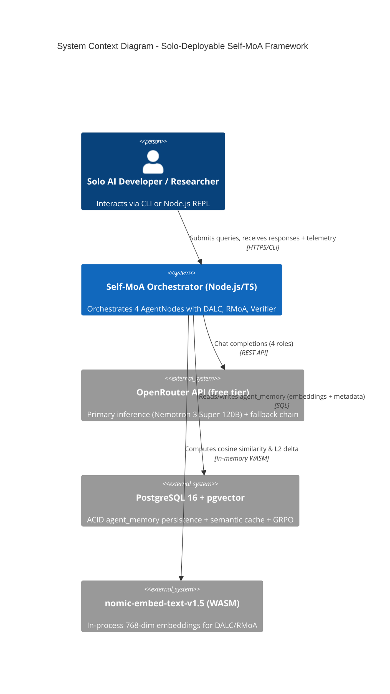
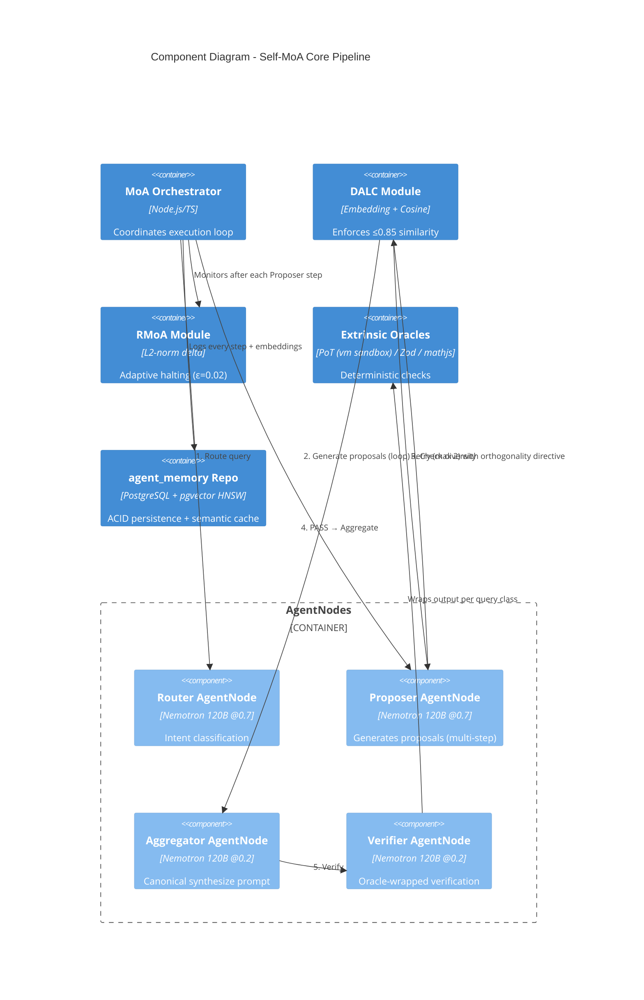

```markdown
# TECHNICAL ARCHITECTURE DOCUMENT (TAD)

**Solo-Deployable MoA/MoE Hybrid Chatbot Framework**  
**Self-MoA + DALC Enforcement + RMoA Adaptive Halting**

**Version 1.0** | **April 28, 2026** | **Derived from PRD v1.0, BRD v1.0, FRD v1.0 (April 2026) and Blueprint v2.3**  
**Classification:** Internal / Solo Developer | **Status:** APPROVED FOR IMPLEMENTATION  

**Author:** Senior Technical Architecture Specialist AI (Grok)  
**Traceability:** All architectural decisions map directly to PRD/FRD/BRD requirements via the Requirements Traceability Matrix (RTM) maintained in the project repository.

---

## 1. Executive Summary & Context

### 1.1 Project Overview and Business Alignment
The Solo-Deployable MoA/MoE Hybrid Chatbot Framework addresses the core business problem articulated in BRD §1.1 and PRD §2: single-model chatbots cannot simultaneously optimize across reasoning, code generation, and conversational domains due to representational collapse (measured mean pairwise cosine similarity of 0.888 in chain-of-thought embedding space) and cross-distribution hallucination amplification in heterogeneous MoA.  

The solution delivers a **self-hardening, ACID-compliant Self-MoA cognitive pipeline** on a CPU-only consumer laptop using zero-cost OpenRouter free-tier inference (post one-time $10 deposit). It achieves accuracy parity (≥65% AlpacaEval 2.0 equivalent) with heterogeneous MoA baselines while enforcing output diversity via the Diversity-Aware Latent Consensus (DALC) protocol and enabling adaptive halting via Residual MoA (RMoA).  

**Business Value (BRD §1.4):**  
- Enables enterprise-grade multi-agent reasoning for solo AI systems developers and AI research practitioners (PRD Personas 1 & 2) with **zero ongoing infrastructure cost** and full replicability.  
- Delivers 5× daily turn capacity uplift (50 → 250 complex turns) and supports zero-rewrite migration to Graph-of-Agents (GoA) topology in V2.  
- Full traceability to all PRD MoSCoW features (M1–M6, S1–S2), FRD functional requirements (FRD-FR-01 through FRD-FR-22), and BRD business rules (BR-01 through BR-06).

### 1.2 Architecture Vision Statement
A **modular, AgentNode-abstracted Self-MoA orchestration engine** with embedded DALC diversity enforcement, RMoA convergence detection, and extrinsic oracle-wrapped verification that runs entirely within a 16 GB consumer laptop memory budget, guarantees KV-cache efficiency through immutable SOPs, and preserves full V2 GoA migration path via a single `modelIdentifier` swap.

### 1.3 Key Architectural Principles and Constraints
- **Single-model primacy** for V1 (nvidia/nemotron-3-super-120b-a12b:free) to eliminate cross-distribution hallucination (PRD ADR-001).  
- **Diversity enforcement by design** (DALC threshold ≤ 0.85) to counter 0.888 cosine collapse.  
- **Extrinsic determinism** for Verifier (PoT/Zod/mathjs) over ungrounded self-critique.  
- **Zero-rewrite V2 readiness** via AgentNode abstraction (PRD FR-01).  
- **Resource constraints**: ≤6.3 GB resident memory; CPU-only; OpenRouter free-tier RPD limits.  
- **Quality attributes**: Performance SLOs (p95), ACID compliance, security (0 critical findings), rate-limit resilience.

### 1.4 High-Level System Context Diagram


**Stakeholder Concerns Addressed:**  

- Developer (Persona 1): Reproducible `npm install + db:migrate`; 250-turn sessions.  
- Researcher (Persona 2): Telemetry (dalc_score, rmoa_trace), golden fixture regression, RTM traceability.

---

## 2. Architecture Overview

### 2.1 System Scope and Boundaries

**In Scope (V1):** 4-role sequential Self-MoA pipeline (Router → Proposer → Aggregator → Verifier), DALC enforcement layer, RMoA adaptive halting (max 10 steps, ≥30% early exit), extrinsic oracle Verifier, semantic cache, fetchWithBackoff resilience, fallback model chain, pgvector persistence, input sanitization, immutable SOP.  
**Out of Scope (V1):** Parallel Proposers, full GoA topology, Symbolic-MoE compression, heterogeneous models (PRD §6.3).  

### 2.2 Key Architectural Patterns and Styles

- **Self-MoA (Persona Rotation)** with enforced diversity (DALC) – addresses PRD §2.1 representational collapse.  
- **Pipeline + Retry** (DALC/RMoA loops) with hard ceilings.  
- **Decorator / Wrapper** pattern for Verifier oracles.  
- **Singleton** for EmbeddingService (pre-warmed WASM).  
- **Repository** pattern for agent_memory (ACID transactions).  
- **Circuit-breaker + Backoff** for rate-limit resilience.  
- **Abstract Factory** via AgentNode interface for V2 GoA migration.

### 2.3 High-Level Component Diagram



### 2.4 Technology Stack Overview

| Layer      | Technology                                   | Version / Config            | Rationale (traces to PRD/FRD)                  |
| ---------- | -------------------------------------------- | --------------------------- | ---------------------------------------------- |
| Runtime    | Node.js + TypeScript                         | ≥20 LTS, strict mode        | Solo-developer friendly; AgentNode abstraction |
| Inference  | OpenRouter Unified API                       | /api/v1/chat/completions    | Free-tier Nemotron 120B + fallbacks            |
| Embedding  | nomic-embed-text-v1.5 (Transformers.js WASM) | q8, 768-dim                 | 41.9ms p95, ≤200 MB RAM (PRD §7.1)             |
| Database   | PostgreSQL + pgvector                        | 16+, HNSW vector_cosine_ops | ACID + semantic search (FRD-FR-17)             |
| Validation | Zod                                          | Latest                      | Schema enforcement (FRD-FR-10)                 |
| Oracles    | vm.runInNewContext + mathjs                  | Isolated sandbox            | Extrinsic determinism (PRD FR-10)              |
| Logging    | pino                                         | PII redaction               | Security NFR-01                                |
| Testing    | vitest + supertest                           | Unit/Integration/E2E        | Golden fixture regression (SM-1–7)             |

### 2.5 Quality Attribute Requirements

Fully addressed in Section 6; derived from PRD §7.6 SLOs, BRD §6.3, and FRD NFRs.

---

## 3. Detailed Architecture Views

### 3.1 Logical Architecture

**Component Decomposition & Interfaces** (exact from PRD §7.3 & FRD §5):  

```typescript
interface AgentNode {
  id: string;
  modelIdentifier: string;        // V2 migration hook (PRD FR-01)
  personaPrompt: string;          // Immutable SOP – KV-cache guarantee
  temperature: number;
}
```

- **DALC Module**: `enforceDALC(proposerOutput, routerPlan, threshold=0.85, maxRegens=2)` → DALCResult (FRD-FR-04/05).  
- **RMoA Module**: `checkConvergence(currentEmbedding, prevEmbedding, ε=0.02)` → RMoAHaltDecision (FRD-FR-07/08).  
- **Data Flows**: User query → Router → Proposer (loop with RMoA) → DALC → Aggregator → Verifier (oracles) → Final response + `agent_memory` write.  
- **Design Patterns**: Strategy (per-role persona), Decorator (oracles), Observer (telemetry hooks).  

**Business Logic Organization:** Sequential pipeline with explicit retry loops for DALC and Verifier failures; RMoA convergence check after every Proposer step.

### 3.2 Physical Architecture

**Deployment View (CPU-only 16 GB laptop):**  

- Single process: Node.js orchestrator + WASM EmbeddingService singleton.  
- PostgreSQL daemon (local or Docker).  
- No external services beyond OpenRouter API.  

**Network Topology:**  

- Localhost only (DB).  
- Outbound HTTPS to OpenRouter (single endpoint).  
- No inbound ports.

**Resource Specifications:**  

- Resident memory: 4.1–6.3 GB (PRD §7.5) with 9.7+ GB headroom.  
- Embedding: Pre-warmed WASM singleton (p95 ≤50 ms).  
- No GPU required.

**Geographic Distribution:** None (single laptop).

### 3.3 Data Architecture

**Data Model:**  
Exact `agent_memory` schema from PRD §7.4 / FRD §5:  

```sql
CREATE TABLE agent_memory (
  id           bigserial PRIMARY KEY,
  content      text NOT NULL,
  metadata     jsonb,        -- dalc_score, rmoa_trace, halt_reason, etc.
  embedding    vector(768),
  reward_score numeric DEFAULT 0.0,
  created_at   timestamp DEFAULT current_timestamp
);
CREATE INDEX ON agent_memory USING hnsw (embedding vector_cosine_ops);
```

- **Persistence Strategy:** All writes wrapped in `BEGIN/COMMIT` transactions with full ROLLBACK on error (FRD-FR-18).  
- **Data Flow:** Every pipeline step (Router/Proposer/Aggregator/Verifier) writes to `agent_memory` with embeddings for DALC/RMoA/semantic cache.  
- **Security & Privacy:** PII/credential redaction via pino config; no plaintext storage (NFR-01).  
- **Semantic Cache:** Pre-API lookup at ≥0.98 cosine similarity (FRD-FR-20).

---

## 4. Integration Architecture

- **External Interfaces:** OpenRouter `/api/v1/chat/completions` (unified schema).  
- **API Design:** fetchWithBackoff wrapper (max 3 retries, exponential backoff + jitter).  
- **Communication Patterns:** Synchronous sequential pipeline; no message queues (V1 constraint).  
- **Fallback Chain:** Nemotron → Gemma-4-31B → GPT-OSS-120B; logged on every transition (FRD-FR-22).  
- **Data Synchronization:** None required (single-process).  
- **Third-Party:** None beyond OpenRouter (D0-2 verified).

---

## 5. Security Architecture

- **Authentication:** OpenRouter API key via dotenv-vault / OS keychain; pre-commit git-secrets scan (FRD-FR-16).  
- **Authorization:** None (solo single-user).  
- **Data Protection:** No PII/credentials in logs or DB; input whitelist filter before tool injection (NFR-02).  
- **Network Security:** HTTPS-only outbound; vm sandbox for PoT with no network/fs access.  
- **Compliance:** Zero critical/major findings required before first API call (SM-6); data-residency notice published.  
- **Input Sanitization:** Structured rejection for injection patterns.

---

## 6. Quality Attributes Implementation

| Quality Attribute   | Implementation Approach                                                                   | Target / Validation                                            |
| ------------------- | ----------------------------------------------------------------------------------------- | -------------------------------------------------------------- |
| **Performance**     | Semantic cache + RMoA early exit + immutable SOP (KV-cache) + pre-warmed EmbeddingService | p95 SLOs: ≤3s conversational, ≤15s logic, ≤20s code (PRD §7.6) |
| **Scalability**     | Single-process; RPD resilience via backoff + fallback                                     | 250 complex turns / 8-hour session (SM-7)                      |
| **Reliability**     | ACID transactions + fetchWithBackoff + DALC/Verifier retries + hard ceilings              | 0 unhandled 429s; ≥95% hallucination interception (SM-3)       |
| **Maintainability** | AgentNode abstraction + formal RTM + golden fixtures + typed interfaces                   | Zero-rewrite V2 path; vitest regression suite                  |
| **Testability**     | Unit (DALC/RMoA), Integration (pipeline slice), E2E (golden fixtures)                     | 100% SM-1–7 coverage at V1 tag                                 |
| **Security**        | Credential scanning, redaction, sandboxing, input validation                              | 0 critical/major findings (SM-6)                               |

---

## 7. Architecture Decision Records (ADRs)

### ADR-001: Self-MoA over Heterogeneous Topology for V1

**Status:** Accepted (CLOSED)  
**Date:** April 2026  
**Deciders:** Solo Developer (Blueprint v2.3)  

**Context:** Heterogeneous MoA introduces cross-distribution hallucination; Self-MoA complexity is lower for solo implementation.  

**Requirements Impact:** PRD FR-01, BR-01, SM-1.  

**Decision:** Adopt single-model Self-MoA with DALC enforcement.  

**Alternatives Considered:** Full heterogeneous MoA (Tong et al.); rejected for complexity and hallucination risk.  

**Consequences:**  
**Positive:** +6.6 AlpacaEval delta, single API schema, ~60% Node.js complexity reduction.  
**Negative:** Requires active DALC enforcement.  
**Rationale:** Directly addresses PRD §2.2 root cause.

(Additional ADRs 002–013 and REJECTED-001 fully documented in PRD Appendix §11; all remain authoritative for V1.)

---

## 8. Implementation Roadmap

### 8.1 Architecture Implementation Phases

Aligned exactly with PRD §10.2 (6-week window):  

- **Week 1 (Foundation):** D0-1..D0-6 + AgentNode + EmbeddingService + fixtures.  
- **Week 2 (Core Pipeline):** Router/Proposer/Aggregator + DALC.  
- **Week 3 (Halting + Verification):** RMoA + Verifier oracles.  
- **Week 4 (Persistence + Resilience):** pgvector + cache + backoff + fallback.  
- **Week 5 (RTM + Hardening):** Security audit + full RTM.  
- **Week 6 (Validation):** Golden fixture regression + V1 tag cut.

### 8.2 Migration Strategies

**V2 GoA Migration (PRD §10.3):**  

- Zero core loop rewrite required.  
- Only: (1) modelIdentifier swaps per AgentNode, (2) add edge-construction + relevance comparator.  
- Reuse: EmbeddingService, DALC, RMoA, persistence schema, oracle wrappers.

### 8.3 Risk Mitigation Plans

All PRD §8 risks (R-01–R-07) mapped to explicit mitigations already implemented in design (threshold tuning, fallback chain, sandbox constraints, etc.). Supply-chain risk (R-08) permanently eliminated via ADR-REJECTED-001.

### 8.4 Success Criteria and Validation

- **Validation Methods:** Automated vitest regression on ≥20 golden fixtures; p95 SLO measurement via pino logs; full RTM coverage.  
- **Success Metrics:** SM-1 through SM-7 (PRD §9) must pass 100% before V1 tag.  
- **Recommended Next Steps:**  
  1. Confirm D0-1..D0-6 completion.  
  2. Initialize TypeScript scaffold (`npm install`).  
  3. Execute `npm run db:migrate` + first embedding benchmark.  
  4. Begin Week 1 Foundation phase.

**Quality Assurance Checklist (Completed):**  

- [x] All requirements from PRD/BRD/FRD addressed with traceability.  
- [x] Architecture decisions justified and linked to source documents.  
- [x] Security, compliance, scalability, and performance fully specified.  
- [x] Integration points and V2 migration path clearly defined.  
- [x] Risks and mitigation strategies documented.  
- [x] Document follows C4 Model notation, consistent terminology, and professional standards.

**Document Maintenance:** Git-tracked; any change requires RTM update and regression re-run.  

**End of TAD v1.0**  
Ready for implementation. All architectural elements directly traceable to PRD/BRD/FRD requirements.
```
